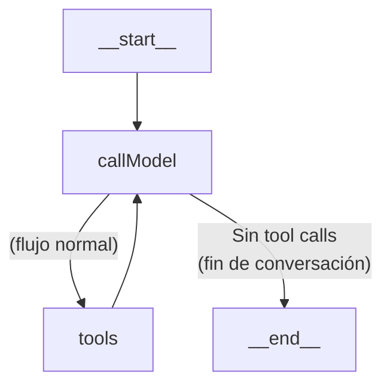
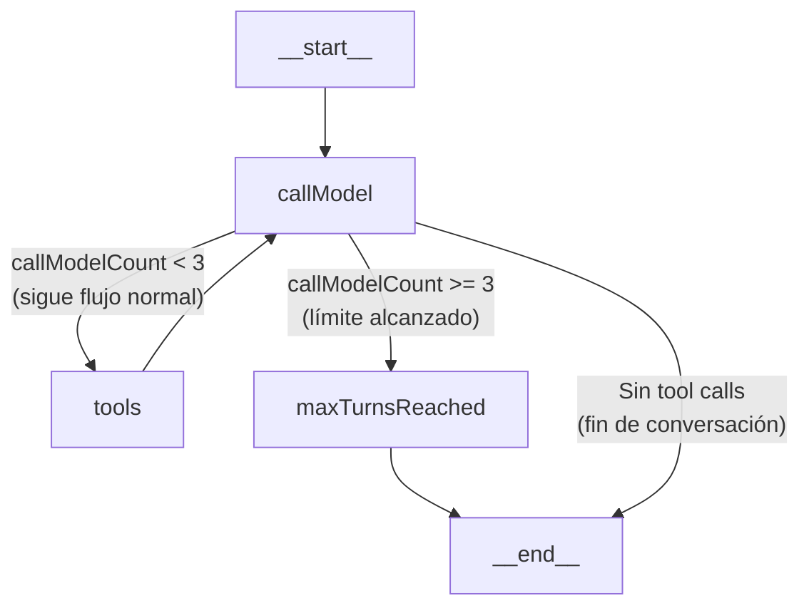

# 🧠 Workshop – Crea tu primer AI Agent con LangGraph

Este proyecto es una plantilla diseñada para enseñar a desarrolladores cómo crear agentes conversacionales usando LangGraph. Algunas de sus características clave incluyen:

* Agente ReAct funcional, con razonamiento y herramientas
* Backend basado en LangGraph y LangChain
* Frontend moderno con Next.js 15, Tailwind CSS y Radix UI
* Arquitectura monorepo con Turborepo
* Streaming en tiempo real de respuestas del agente
* Soporte para múltiples modelos LLM como Anthropic Claude y OpenAI GPT
* Integración con herramientas externas como Tavily
* Interfaz de chat interactiva y personalizable

Este proyecto sirve como base para aprender, prototipar y extender agentes más avanzados.

Este repositorio contiene los pasos y materiales necesarios para completar el workshop de creación de agentes conversacionales con [LangGraph](https://github.com/langchain-ai/langgraph).

Aprenderás a generar un proyecto desde cero usando [`create-agent-chat-app`](https://github.com/langchain-ai/create-agent-chat-app) y a personalizar un agente ReAct dentro de una app React con Next.js.

---

## 🚀 Paso 1 – Genera tu proyecto

Ejecuta el siguiente comando en tu terminal:

```bash
npx create-agent-chat-app
```

Responde a las siguientes opciones cuando se te pregunte:

```
◇  What is the name of your project? my-first-agent
◇  Which package manager would you like to use? › npm
◇  Would you like to automatically install dependencies? Y
◇  Which framework would you like to use? › Next.js
◆  Which pre-built agents would you like to include?
│  [x] ReAct Agent
│  [ ] Memory Agent
│  [ ] Research Agent
│  [ ] Retrieval Agent
```

Esto creará una nueva carpeta `my-first-agent` con todo el código necesario para empezar.

---

## ⚙️ Paso 2 – Configura las variables de entorno

Dentro del directorio del proyecto (`my-first-agent`), copia el archivo de ejemplo de variables de entorno:

```bash
cp .env.example .env
```

> 📁 Este archivo contiene las claves necesarias para ejecutar el agente. Asegúrate de reemplazar los valores por tus propias credenciales antes de continuar.

Necesitarás obtener claves API desde los siguientes proveedores:

* [Anthropic](https://console.anthropic.com/account/keys)
* [OpenAI](https://platform.openai.com/api-keys)
* [Tavily](https://app.tavily.com/settings/api-keys)
* Gemini, Grok, etc.

> ⚙️ El proyecto viene configurado por defecto para funcionar con **Anthropic**. Si deseas usar otro proveedor (como OpenAI), además de configurar la clave correspondiente en el `.env`, debes modificar el modelo por defecto en el archivo:
>
> ```ts
> apps/agents/src/react-agent/configuration.ts
> ```

---

## 💻 Paso 3 – Ejecuta el proyecto en desarrollo

Dentro del directorio del proyecto:

```bash
npm run dev
```

Luego abre tu navegador en:

```
http://localhost:3000
```

Ahí podrás empezar a interactuar con tu primer agente conversacional.

Además, si estás ejecutando el backend correctamente, también tendrás acceso a:

* 🚀 API: [http://localhost:2024](http://localhost:2024)
* 🎨 Studio UI: [https://smith.langchain.com/studio?baseUrl=http://localhost:2024](https://smith.langchain.com/studio?baseUrl=http://localhost:2024) – esta herramienta permite interactuar y depurar el comportamiento del agente en tiempo real

---

## 🎓 Paso 4 – ¿Y ahora qué?

En esta etapa vamos a interactuar directamente con el agente.

Puedes hacer lo siguiente:

* Utiliza la ventana de chat en `http://localhost:3000` para probar prompts y ver cómo responde el agente.
* Abre la interfaz de LangSmith Studio ([https://smith.langchain.com/studio?baseUrl=http://localhost:2024](https://smith.langchain.com/studio?baseUrl=http://localhost:2024)) para observar cómo se ejecutan los pasos del grafo en tiempo real, ver trazas y depurar su comportamiento.

---

## 🧩 Paso 5 – Descripción del proyecto generado

El proyecto generado está organizado como un monorepo con dos aplicaciones principales:

### 📂 apps/ – Aplicaciones Principales

#### 🤖 apps/agents/ – Backend del Agente

Contiene toda la lógica del agente conversacional:

* `src/react-agent/`

  * `graph.ts`: ❤️ Núcleo del agente – Define el flujo de conversación y el grafo de estados
  * `configuration.ts`: ⚙️ Configuración del modelo y prompts
  * `tools.ts`: 🛠️ Herramientas disponibles para el agente (como búsqueda web)
  * `prompts.ts`: 💬 Instrucciones base para el comportamiento del agente
  * `utils.ts`: 🔧 Funciones auxiliares
* `tests/`

  * `integration/`: 🔗 Pruebas del flujo completo
  * `unit/`: 🧪 Pruebas de componentes individuales

  ### Diagrama del grafo ReAct (Reason-Act)



#### 🌐 apps/web/ – Frontend de la Aplicación

Interfaz en Next.js 15 para interactuar con el agente:

* `src/app/`: Páginas, layouts y estilos globales
* `components/`

  * `thread/`: 🧵 Conversación, historial, mensajes y herramientas
  * `agent-inbox/`: 📥 Estado interno del agente y acciones
  * `ui/`: 🎛️ Componentes de interfaz (botones, inputs, tarjetas)
* `hooks/`, `lib/`, `providers/`: 📦 Lógica compartida, streaming, estado y conexión API

Esta estructura modular facilita la comprensión del sistema, la personalización del agente y su extensión futura.

---

## 🛠️ Paso 6 – Creación de herramientas

En esta etapa aprenderás cómo extender las capacidades de tu agente añadiendo herramientas personalizadas.

### 🧠 Wikipedia Tool

Usaremos la herramienta `WikipediaQueryRun` para que el agente pueda realizar búsquedas en Wikipedia.

**Instalación:**

```bash
npm install @langchain/community
```

**Ejemplo de uso (en `apps/agents/src/react-agent/tools.ts`):**

```ts
import { WikipediaQueryRun } from "@langchain/community/tools/wikipedia_query_run";

const wikipediaTool = new WikipediaQueryRun({
  topKResults: 3,
  maxDocContentLength: 4000,
});

// Actualiza el array TOOLS para incluir la nueva herramienta
export const TOOLS = [searchTavily, wikipediaTool];
```

Esto permitirá al agente buscar y extraer información de Wikipedia como parte de su razonamiento.

---

### 🧩 Tool personalizada – adder

También puedes crear herramientas propias usando la función `tool` de LangChain. Por ejemplo, una herramienta para sumar dos números:

**Ejemplo (en `tools.ts`):**

```ts
import { tool } from "@langchain/core/tools";
import { z } from "zod";

export const adderTool = tool(
  async ({ a, b }: { a: number; b: number }): Promise<string> => {
    const sum = a + b;
    return `La suma de ${a} y ${b} es ${sum}`;
  },
  {
    name: "adder",
    description: "Suma dos números proporcionados",
    schema: z.object({
      a: z.number(),
      b: z.number(),
    }),
  }
);
```

---

### 🌐 Tool personalizada – consumo de API externa

Puedes integrar herramientas que se conecten a APIs externas. Aquí un ejemplo que consume una API de clima:

```ts
import { tool } from "@langchain/core/tools";
import { z } from "zod";

export const weatherTool = tool(
  async ({ city }: { city: string }) => {
    const response = await fetch(`https://wttr.in/${city}?format=3`);
    const result = await response.text();
    return result;
  },
  {
    name: "weather",
    description: "Obtiene el clima actual de una ciudad",
    schema: z.object({
      city: z.string(),
    }),
  }
);
```

Esto permite que el agente haga consultas a APIs externas y use esa información como parte de su respuesta.

### 🧪 Reto: crea tu propia herramienta

Ahora que ya sabes cómo integrar herramientas externas y personalizadas, intenta crear una por tu cuenta.

Puedes inspirarte en las integraciones disponibles aquí:
👉 [Lista de herramientas en LangChain.js](https://js.langchain.com/docs/integrations/tools/)

**Ideas de herramientas personalizadas:**

* 📅 Consulta de eventos en Google Calendar
* 📰 Búsqueda de noticias con una API de noticias
* 📦 Seguimiento de envíos por número de guía
* 🌤️ Clima actual en una ciudad
* 📈 Consulta de precios de criptomonedas o acciones

## ¡Atrévete a experimentar!

---

* [Documentación oficial de LangGraph](https://docs.langchain.com/langgraph)
* [Guía del generador create-agent-chat-app](https://github.com/langchain-ai/create-agent-chat-app)
* [Ejemplo de agente ReAct](https://github.com/langchain-ai/langgraph/blob/main/examples/react/README.md)

---


## 🧮 Paso 7 – Ejercicio: Contador de llamadas a `callModel`

En este ejercicio aprenderás a trabajar con el **estado** en LangGraph. Implementarás un contador que se incrementa cada vez que el nodo `callModel` es ejecutado.

### ¿Por qué es importante?
El estado permite que el agente recuerde información entre pasos del grafo. Es fundamental para flujos conversacionales avanzados, seguimiento de contexto, historial, etc.

### Objetivo
Agregar una propiedad `callModelCount` al estado y hacer que se incremente automáticamente en cada llamada a `callModel`.

### Pasos (compatible con la plantilla actual)

1. **Extiende el estado base de LangGraph**
   - Abre `apps/agents/src/react-agent/graph.ts`.
   - Extiende la anotación base para incluir el contador:

   ```ts
   import { MessagesAnnotation, Annotation } from "@langchain/langgraph";

   // Extiende el estado base para incluir el contador
   const CustomAnnotation = Annotation.Root({
     ...MessagesAnnotation.spec,
     callModelCount: Annotation<number>({
       value: (prev, next) => next,
       default: () => 0,
     }),
   });
   ```

2. **Usa el nuevo estado en el grafo**
   - Cambia la definición del grafo para usar tu anotación extendida:

   ```ts
   const workflow = new StateGraph(CustomAnnotation, ConfigurationSchema)
     // ...nodos y edges como antes...
   ```

3. **Incrementa el contador en `callModel`**
   - Ajusta la función para leer y actualizar el contador:

   ```ts
   async function callModel(
     state: typeof CustomAnnotation.State,
     config: RunnableConfig,
   ): Promise<typeof CustomAnnotation.Update> {
     // ...código existente...
     const currentCount = state.callModelCount ?? 0;
     // Llama al modelo como antes...
     const response = await model.invoke([
       // ...prompt...
       ...state.messages,
     ]);
     // Devuelve el nuevo estado, incrementando el contador
     return {
       messages: [response],
       callModelCount: currentCount + 1,
     };
   }
   ```

4. **Ajusta los tipos en el resto del archivo**
   - Asegúrate de que las funciones que reciben el estado usen `CustomAnnotation.State` en vez de `MessagesAnnotation.State`.

### Resultado esperado
Cada vez que el agente pase por el nodo `callModel`, el contador aumentará. Puedes inspeccionar el estado en LangSmith Studio o imprimirlo para verificar que funciona.

### Diagrama del grafo condicional



## 📚 Ramas de ejercicios

Este repositorio contiene ramas específicas para cada ejercicio práctico del taller:

- **`state-conditional`**: Incluye el ejercicio completo de agregar una variable de estado (`callModelCount`) y una arista condicional que cambia el flujo del grafo según ese estado.
- **`human`**: Muestra el código para implementar un flujo human-in-the-loop, donde el agente puede pausar la ejecución y pedir confirmación o input humano antes de continuar.

Puedes cambiar de rama con:

```bash
git switch state-conditional
# o
git switch human
```

Cada rama contiene el código y los comentarios necesarios para entender y probar el ejercicio correspondiente.

